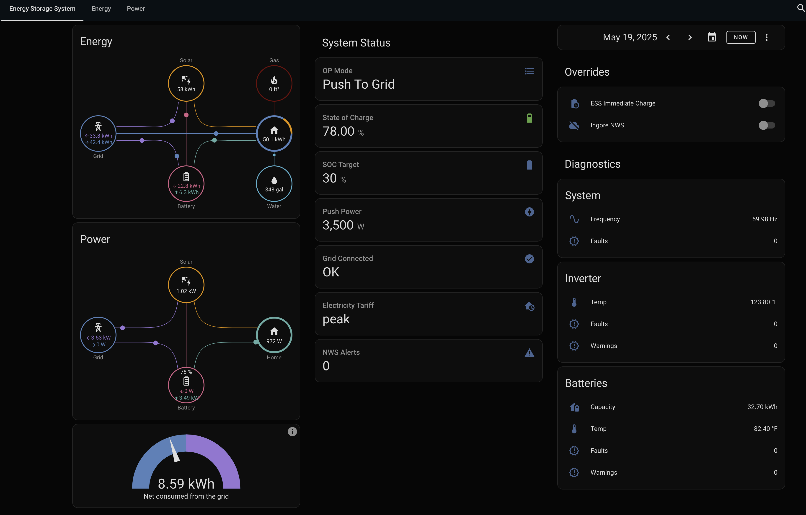

# Alpha2MQTT (A2M)
## A Home Assistant controller for AlphaESS solar and battery inverters.

_**Credit!** This project is entirely derived from https://github.com/dxoverdy/Alpha2MQTT (original README is [here](README-orig.md))which is a really great bit of work.  My hardware is just some small tweaks on that project's hardware.  My software has changed a lot from that project, but at its core, this project is derived from that project and would not exist without that project. So HUGE credit and thanks._

**What is this?** This project is a controller that connects Home Assistant to an AlphaESS system via RS485 and uses MQTT discovery to set up a ready to go integration.  This is local control with NO cloud dependancy.  Once you plug-in and turn on this A2M hardware, your ESS will appear as a unique HA/MQTT device with HA entities ready to monitor and control your AlphaESS system.  No HA configuration is needed.  The entities are ready to be used by the Energy dashboard and can be included in other dashboards and automations.  (Examples below.)  This controller also provides [Operating Modes](#operating-modes) that enhance the AlphaESS functionality while making it simpler to control.

**What's Different?** The big change is that rather than being a general purpose interface between MQTT and an AlphaESS system, this project is a controller specifically designed to work as a Home Assistant integration for your AlphaESS system.  It uses MQTT discovery to be plug-and-play so that no HA configuration is needed.  And it adds some "smart", real-time capabilities in the controller so that HA automation control is simplified.  This also incorporates several newer versions of the [AlphaESS specs](#alphaess-specs), and has enhancements/tweaks/fixes to WiFi and RS485 functionality.

### Supported AlphaESS devices are:
- I have only tested this on a SMILE-SPB system.

- The [original project](README-orig.md) was tested on these systems which _should_ work, but I really can't say until someone tests them.
  - SMILE5,
  - SMILE-B3,
  - SMILE-T10,
  - Storion T30,
  - SMILE-B3-PLUS
  - *Others are likely to work too.

## Steps to get running.
- Build the hardware.  (See [HARDWARE](#hardware) below)
- Configure, build and load the software.  Follow the instructions in the [original README](README-orig.md#flashing).  For changes to Definitions.h you should follow the instructions in the file itself, as this file has changed a fair bit.
- Enable MQTT discovery in Home Assistant (if this isn't on already).
- Plug in RS485 and power.  At this point your device/entities will appear under the MQTT integration as "A2M-ALXXXXXXXXXXXXX".)  You can now see and monitor your ESS in HA.
- (optional) Configure the HA Energy dashboard to use these new entities.  All the necessary entities are provided for grid, solar, and battery.
- (optional) Create an ESS dashboard.  (See [Dashboard Example](#dashboard-example) below.)
- (optional) Create ESS automations to control the ESS.  (See [Automations Example](#automation-examples) below.)

## More Details
### What you will see
- Once your Alpha2MQTT device is working, in Home Assistant go to Settings->Devices & Services->Integrations->MQTT->devices
- In this list is your new Alpha2MQTT device which starts with "A2M" and ends with your serial number.  In this image it is the top entry. (The 2nd entry is my dummy testing device which you won't see.)

- Now click on your device and you'll see this, which is every entity that is provided for your device:

### Operating Modes
To control your ESS, set an Operating Mode and the control parameters used for that mode.  Operating Modes are a bit different from AlphaESS internal modes.  They are similar, but add more fuctionality.  For example, most Alpha modes don't honor a target SOC, but most Operating Modes do.  Here are all the modes:
- "**Load Follow**": This is the same as the AlphaESS "Load Follow" except this also honors the "SOC Target" setting.  Alpha says their "Load Follow" mode and their "Normal" modes are the same.  This will also use the "Charge Power" and "Discharge Power" settings.  I don't personally use this mode.
- "**Target SOC**": This will charge or discharge the ESS, as appropriate, to reach the "SOC Target".  This will use the "Charge Power" and "Discharge Power" settings.
- "**Push To Grid**": This will push power to the grid until the "SOC Target" is reached.  It only uses the "Push Power" setting to determine the discharge power.  When PV is producing more than the house loaed, this pushes the excess PV power **plus** the "Push Power" amount to the grid.  When PV is producing less than the house load, then this pushes the "Push Power" amount to the grid.  The Alpha2MQTT controller dynamically adjusts the AlphaESS setting (without needing HA involvement) to achieve this.
- "**PV Charge**": This will charge the ESS only from PV power that exceeds the house load.  This uses the "SOC Target" and "Charge Power" settings.  When PV power is less than the house load, the grid is used to supply the difference.  If PV power exceeds the house load plus "Charge Power", or if the "SOC Target" is reached, then excess PV is pushed to the grid.
- "**Max Charge**": This will charge the ESS from any source (PV or grid) as fast as it can until it is full.  Grid supplies the house load.  Excess PV is pushed to the grid.
- "**No Charge**": This will not charge the ESS from any source, and will use the ESS for house loads when PV is less than the house load.  Excess PV is pushed to the grid.
### AlphaESS Specs
Alpha2MQTT honours 1.28 AlphaESS Modbus documentation.  The latest register list I found came from October 2024.

- [AlphaESS Modbus Documentation](Pics/AlphaESS_Register_parameter_list_Oct_2024.pdf)

- [AlphaESS Register List](Pics/AlphaESS_Modbus_Protocol_V1.28.pdf)

### Hardware
To build this hardware you need to follow the [original project instructions](README-orig.md#how-to-build).  While I originally started with an ESP8266, I switched to an ESP32 for better WiFi and I have only tested with the ESP32 for a while.  (However, the ESP8266 _should_ still work.)  I also went to a larger display.  This isn't necessary, but did help with debugging.  And I used a different MAX3485 part because I liked the form factor better.  If you use this, be sure to connect the EN pin.  Here are links to the parts I used.
- [ESP 32](https://www.amazon.com/gp/product/B0CL5VGC8J)
- [Display](https://www.amazon.com/gp/product/B09C5K91H7)
- [MAX3485](https://www.amazon.com/gp/product/B09SYZ98KF)

### Dashboard Example
- I tied into the Home Assistant builtin Energy dashboard by simply editing its configuration and adding grid to/from, solar, battery to/from, and battery SOC.  Voila!
- Here is my ESS dashboard.  This was simple to make using the HA builtin visual editor. ([Here](Dave_Examples/Dave_ESS_Dashboard.yaml.txt) is the yaml.)  I used "energy-flow-card-plus" and "power-flow-card-plus" which are available through HACS.  In the middle section there are several entities that appear and disappear depending on the current Op Mode.  In the right section you can click on any of the Faults or Warnings, the click on the Attributes, and you will see which registers are monitored and which bits are set.

### Automation Examples
- ESS control - First off, I **highly** recommend that you have only ONE system controlling your ESS.  Alpha2MQTT can be used to simply monitor your ESS.  However, if you are using Alpha2MQTT to control your ESS, then be sure no other system is controlling it.  I allow the Alpha cloud to monitor my system, but it does NO control.
  - This control is a little complex, but not too bad.  Let me try to explain all the parts.
    - My peak electricity price hours are 4pm to 9pm.  My mid-peak is 3pm to 4pm and 9pm to midnight.  Off-peak is midnight to 3pm.  My tarrif allows me to sell power that I push to the grid for the same price that I would pay for it.
    - I try to ONLY use battery or solar during peak and mid-peak.
    - I try to push some saved battery power back to the grid during peak, but only if the SOC is high enough and only when there are no storm alerts. I check, and adjust, each hour during peak.
    - Even though it costs the same, I prefer to charge using solar rather than using the grid, except when there are storms, and then I charge as soon as the rates are cheap.  If I am only charging by solar, then a bit before rates get expensive, I fill the battery fro the grid in case it isn't full.
  - [Here](Dave_Examples/Dave_ESS_Automation.yaml.txt) is my yaml.
- Other Device control
  - You can also use the ESS state to control other devices in Home Assistant.  For example, if Alpha2MQTT detects that the grid has become unavailable, then it turns off my EVSE (car "charger").
  - I'd love to hear what you are controlling...
### Other Changes and Enhancements
- This uses an MQTT Last Will and Testament (LWT) along with 2 other statuses to set the availability of all of its entities.
- This uses the MQTT retain flag along with other MQTT options to ensure as-graceful-as-possible handling of situations where this device, HA, or the MQTT broker might reboot or go offline.
- The WiFi code has been tweaked to better handle Multi-AP environments and low signal situations.
- The RS485 code has been tweaked to better handle more than two peers on the RS485 bus.  While this situation is rare, I had to deal with it during development because my vendor provided control via RS485 as well.  So until I trusted my device to take over, I had to make both controllers coexist.  RS485 fully supports more than two peers.  However, the MAX3485 doesn't provide enough control to make this perfect.  But I was able to make it robust enough.  Also, MODBUS says there can be only one "master" and Alpha2MQTT and my vendor's device are both masters.  But again, it still works well enough.  And now that I trust this controller, I have disconnected the vendor's device.
- The larger display support allows for easier debugging.  This really isn't needed for anything other than debugging.
- There's a lot of debugging information available via MQTT and the large display.  Enabling the different DEBUG options in Definitions.h will add more rotating debug values on the screen and add new Diagnostic entities under the MQTT device.
- The AlphaSniffer project is a quick and dirty RS485 sniffer that lets this hardware sniff the RS485 bus while some other master talks to your AlphaESS.  It streams the (somewhat parsed) output over TCP to a host.
